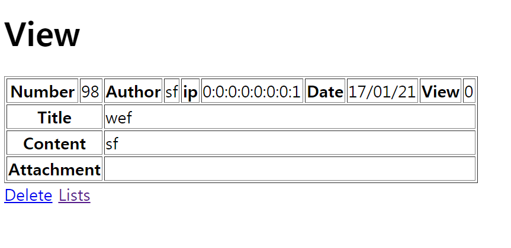
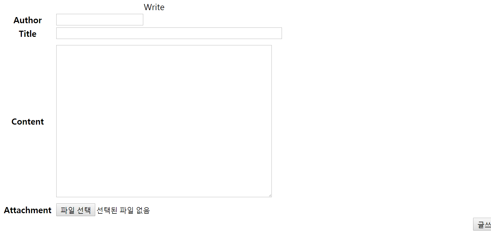

# Homepage

BOARD SYSTEM

1) ADD OR DELETE TEXT 
2) WITHOUT MEMORIZING SOMETHING  
3) EASILY WRITE DOWN YOUR TASKS  
4) ALL OF DATA WILL BE SAVED  

<STRONG> DATABASE HAS BEEN USED </STRONG>
 
<H1>ORACLE DATABASE</H1>
 

 
<h2>Developed in <strong>JSP, MVC Pattern, HTML, CSS</strong></h2>
